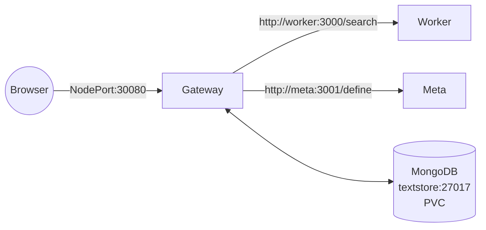

# BookBooker

**Repository:** https://github.com/jackspawwow/bookbooker

**BookBooker** is a tiny microservice application that searches for books and (optionally) returns a short definition for the query. It also lets you save “favorites” in MongoDB with **persistent storage**.

- Public entrypoint: **Gateway** (`/api/search`, `/api/favorites`, `/healthz`)
- Internal services: **Worker** (book search via OpenLibrary or sample data), **Meta** (definition), **MongoDB** (favorites)
- Deployable to Kubernetes, independently scalable, Docker images on Docker Hub

## Quick links

- Docker Hub images:
  - `docker.io/jackspawwow/bb-gateway:v5`
  - `docker.io/jackspawwow/bb-worker:v6`
  - `docker.io/jackspawwow/bb-meta:v4`
- Kubernetes: see `k8s/` manifests (namespace, mongo+PVC, worker, meta, gateway)

---

## Architecture

### Components & responsibilities

- **Gateway (Node.js)**  
  - Public REST API. Composes:
    - `books` from **Worker**
    - `definition` from **Meta**
  - CRUD for favorites in MongoDB (create/list/delete)
  - Exposed via NodePort for external access

- **Worker (Node.js)**  
  - `GET /search?q=...` → array of `{title, author, year}`
  - When `OPENLIB=true`, queries **OpenLibrary**; when `false`, serves sample data (offline mode)

- **Meta (Node.js)**  
  - `GET /define?q=...` → array of short strings (can be empty; gateway still responds)

- **Textstore (MongoDB 7)**  
  - Persistent volume claim (`mongo-pvc`) so data survives pod/node restarts

### Diagram

---

## Benefits & challenges (incl. security)

### Benefits
- **Single public endpoint:** gateway exposes `/api/*`.
- **Independent scaling:** scale gateway and worker separately.
- **Switchable data source:** `OPENLIB=true` → OpenLibrary; `false` → local sample.
- **Persistent data:** MongoDB with PVC (survives restarts).

### Challenges
- **Upstream variability:** OpenLibrary latency/outages can impact `/api/search`.
- **Cross-service insight:** tracing/log correlation across gateway→worker/meta→DB.
- **Upgrade hygiene:** old ReplicaSets may leave crashing pods unless cleaned.

### Security & mitigations
- Only **gateway** is exposed (NodePort); **worker**, **meta**, **MongoDB** are **ClusterIP**.
- Config via env vars; no secrets in images. MongoDB only reachable inside cluster.

**Hardening (recommended)**
- NetworkPolicies to restrict traffic (gateway→worker/meta/DB).
- Liveness/readiness probes for all services.
- Resource requests/limits.
- AuthN/AuthZ (e.g., JWT) for `/api/favorites`.
- Caching/rate limits when `OPENLIB=true`.